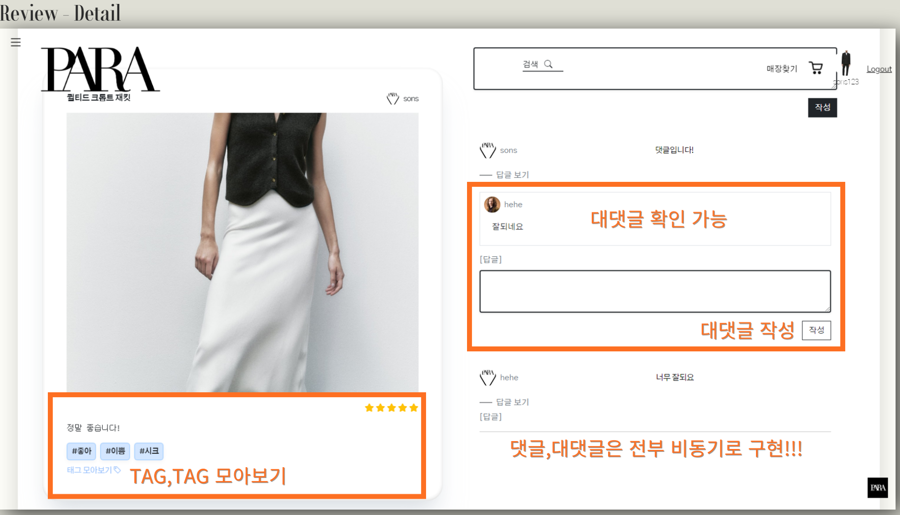
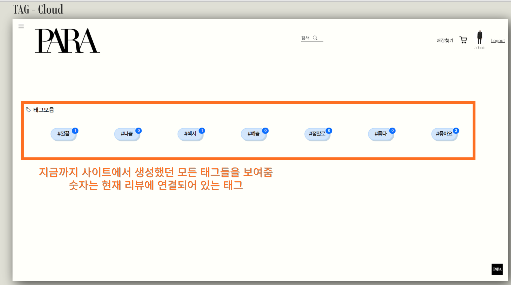
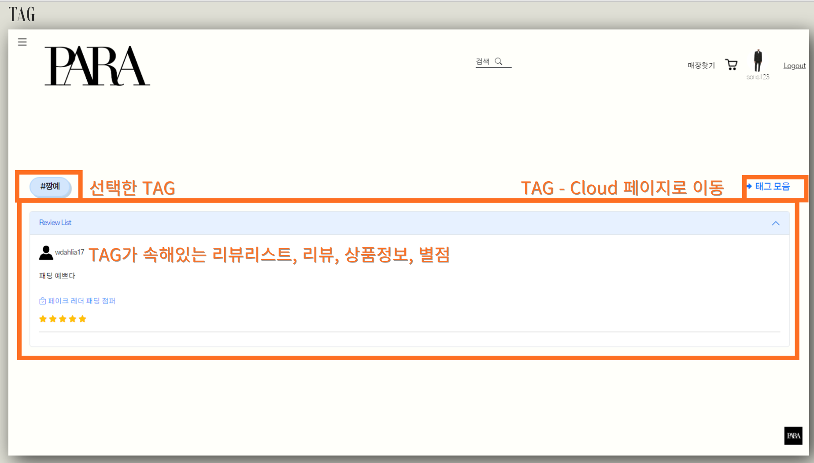

# PARA프로젝트에서 내가 했던 일

### reviews/views.py

##### CRUD

- 배웠던 내용을 바탕으로 구성했기 때문에, 자세한 코드는 생략

##### TAG

```python
class TagCloudTV(TemplateView):
    template_name = "taggit/taggit_cloud.html"
```

```python
class TaggedObjectLV(ListView):
    template_name = "taggit/taggit_post_list.html"
    model = Review

    def get_queryset(self):
        response = Review.objects.filter(tags__name=self.kwargs.get("tag")).select_related(
            "product"
        )
        return response

    def get_context_data(self, **kwargs):
        context = super().get_context_data(**kwargs)
        context["tagname"] = self.kwargs["tag"]
        return context
```

- 원래 하려던 게 review_app가 아닌 product_app에 있는 이름을 가져오는 방법이었는데,
- select_related( "product") 결국 모든 고민이 이 한줄 추가로 내가 원하던 기능이 추가됐다
- 이걸 조교님에게 물어서 알게 된 부분이 불만족스러움

### reviews/templates/taggit(TAG)

##### taggit_clould.html

```html





  <h5 class="font-space fw-bolder">
    <i class="bi bi-tag"></i>&nbsp;&nbsp;태그모음</h5>
  <br>
  <div>
    
    
    <div class="d-flex flex-wrap justify-content-evenly align-items-center">
      
        <h4 class="align-middle my-3 me-5">
          <span class="tag-{{tag.weight|floatformat:0}}">
            <a class="button-74 text-decoration-none d-flex flex-column rounded-pill position-relative mt-1" href="">#{{tag.name}}
              <!-- HTML !-->
              <span class="mt-2 text-center font-space position-absolute top-0 start-100 translate-middle rounded-5 badge bg-primary" style="font-size: 13px;">{{tag.num_times}}</span>
            </a>
          </span>
        </h4>
      
    </div>
  </div>

```

##### taggit_post_list.html

```html






<div class="d-flex justify-content-between align-items-center">
  <h1><span class="badge rounded-pill button-74">#{{ tagname }}</span></h1>
  <div class="text-end">
    <h5 class="mb-0"><a style="text-decoration: none;" class="font-space" href=""><i class="fa-solid fa-right-from-bracket"></i>&nbsp;&nbsp;태그 모음</a></h5>
  </div>
</div>

<br>
<div class="accordion" id="accordionPanelsStayOpenExample">
  <div class="accordion-item">
    <h2 class="accordion-header" id="panelsStayOpen-headingOne">
      <button class="accordion-button font-space" type="button" data-bs-toggle="collapse"
        data-bs-target="#panelsStayOpen-collapseOne" aria-expanded="true" aria-controls="panelsStayOpen-collapseOne">
        Review List
      </button>
    </h2>
    <div id="panelsStayOpen-collapseOne" class="accordion-collapse collapse show"
      aria-labelledby="panelsStayOpen-headingOne">
      <div class="accordion-body">
        
        <div class="card-header my-2">
          
          
          &nbsp;
          <span class="font-space">
            <a href="" class="text-decoration-none text-dark">
              {{ review.user.username }}
            </a>
          </span>
          
          
          <span class="font-space"> 
            <a href="" class="text-decoration-none text-dark">
              {{ review.user.username }}
            </a>
          </span>
          
        </div>
        <div class="py-3 text-truncate">
          <p class="mb-0 text-truncate">
            <a class="align-top text-decoration-none text-dark text-truncate" href="">
              {{ review.content }}
            </a>
          </p>
        </div>
        <div class="py-3">
          <p class="mb-0">
            <a class="align-top text-decoration-none text-primary opacity-75" href="">
              <i class="bi bi-bag-check"></i>&nbsp;{{ review.product.name }}
            </a>
          </p>
        </div>
        <div class="">
          
          <i class="fa-solid fa-star text-warning"></i>
          <i class="fa-regular fa-star text-warning"></i>
          <i class="fa-regular fa-star text-warning"></i>
          <i class="fa-regular fa-star text-warning"></i>
          <i class="fa-regular fa-star text-warning"></i>
          
          <i class="fa-solid fa-star text-warning"></i>
          <i class="fa-solid fa-star text-warning"></i>
          <i class="fa-regular fa-star text-warning"></i>
          <i class="fa-regular fa-star text-warning"></i>
          <i class="fa-regular fa-star text-warning"></i>
          
          <i class="fa-solid fa-star text-warning"></i>
          <i class="fa-solid fa-star text-warning"></i>
          <i class="fa-solid fa-star text-warning"></i>
          <i class="fa-regular fa-star text-warning"></i>
          <i class="fa-regular fa-star text-warning"></i>
          
          <i class="fa-solid fa-star text-warning"></i>
          <i class="fa-solid fa-star text-warning"></i>
          <i class="fa-solid fa-star text-warning"></i>
          <i class="fa-solid fa-star text-warning"></i>
          <i class="fa-regular fa-star text-warning"></i>
          
          <i class="fa-solid fa-star text-warning"></i>
          <i class="fa-solid fa-star text-warning"></i>
          <i class="fa-solid fa-star text-warning"></i>
          <i class="fa-solid fa-star text-warning"></i>
          <i class="fa-solid fa-star text-warning"></i>
          
        </div>
        <hr>
        
      </div>
    </div>
  </div>
</div>


```


### TAG - html



- 리뷰 디테일 페이지에서 TAG,TAG모아보기 기능




- TAG 모아보기 - 사용했던 모든 테그를 한눈에 확인




- TAG를 선택하면 TAG가 속해있는 리뷰를 한번에 볼수 있게 기능

- 제품 명 나오게 기능

